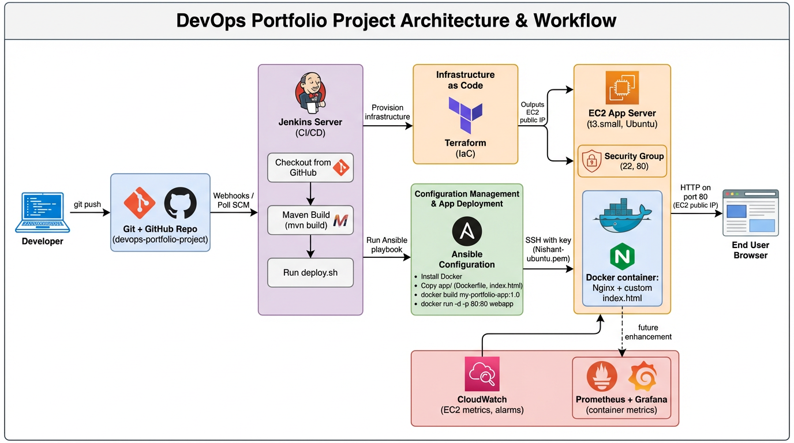

# Automated AWS Provisioning & App Deployment Pipeline

## Project Overview

This project demonstrates a zero-touch, end-to-end automated DevOps pipeline. It uses Infrastructure as Code (IaC) to provision cloud resources, Configuration Management to automatically build and deploy a containerized web application, and Jenkins as a CI/CD orchestrator.

## Tech Stack
* **Cloud Provider:** AWS (EC2, Security Groups)
* **Infrastructure as Code:** Terraform
* **Configuration Management:** Ansible
* **Containerization:** Docker
* **CI/CD Orchestration:** Jenkins
* **Build Tool:** Maven (Simulated)
* **Web Server:** Nginx

## Architecture Workflow
1. **Jenkins** pulls the source code from GitHub and triggers the pipeline.
2. A **Maven** build is executed to compile the application artifacts.
3. **Terraform** initializes and provisions an AWS `t3.small` EC2 instance and configures a Security Group allowing ports 22 (SSH) and 80 (HTTP).
4. A bash wrapper script automatically extracts the dynamically assigned Public IP from Terraform outputs.
5. **Ansible** connects to the newly provisioned instance via SSH, installs Docker, and transfers the application codebase.
6. **Docker** builds a custom Nginx image using the provided `Dockerfile` and deploys the container on port 80.

## How to Run locally
1. Clone this repository.
2. Ensure you have your AWS CLI configured (`aws configure`) and your SSH key `.pem` file in the root directory.
3. Make the script executable: `chmod +x deploy.sh`
4. Run the pipeline: `./deploy.sh`
5. Access the printed Public IP in your browser to view the live application.
